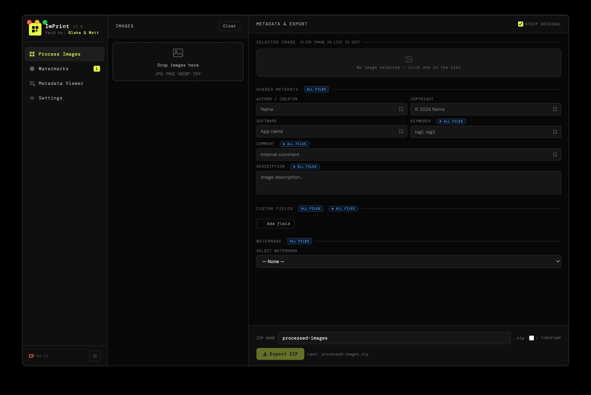

<div align="center">

# ImPrint V2.0

**Bulk image metadata cleaner, EXIF writer, metadata viewer, watermarker, and ZIP exporter — built for creators who care about their work.**

[](LICENSE)
[](https://github.com/Blake-and-Watt/Imprint/releases)
[](https://www.electronjs.org/)
[](https://ko-fi.com/BlakeAndWatt)

*Powered by [Blake & Watt](https://ko-fi.com/BlakeAndWatt)*

<br>



</div>

---

## ⚠️ Legal Disclaimer & Acceptable Use

**By downloading, installing, or using ImPrint in any form, you agree to the following:**

ImPrint is a tool for legitimate image metadata management. It is provided solely for lawful personal, creative, and professional use — including copyright protection, creator attribution, portfolio preparation, and privacy management of your own files.

**ImPrint must not be used for:**
- Removing, falsifying, or circumventing metadata for the purpose of infringing copyright or claiming ownership of work that is not yours
- Stripping provenance data to obscure the origin of AI-generated or synthetic media in contexts where disclosure is legally or contractually required
- Evading digital watermarks, content credentials, or provenance systems embedded by third parties on content you do not own
- Any activity that violates applicable law, including but not limited to copyright law, fraud statutes, or platform terms of service
- Misrepresenting the source, authorship, or licensing status of any image

**The authors and contributors of ImPrint accept no responsibility or liability for how this software is used.** By using ImPrint, you take full and sole responsibility for your actions, the files you process, and all consequences thereof. This includes any legal liability arising from misuse.

This software is provided "as is," without warranty of any kind. The MIT License governs its distribution. Use it responsibly.

---

## What Hole Does Imprint Fill?

If you shoot, create, edit, or sell images — you've run into this problem:

- Stock sites, clients, and social platforms **strip or corrupt** the metadata in your files
- Adding copyright and creator info to dozens of images means clicking through Lightroom or Bridge one at a time
- Your watermark looks right on a 16:9 crop but is completely wrong on a 4:5 or 9:16
- You can't easily inspect what metadata is actually embedded in a file before sending it
- Every time you export, you're hunting for the last ZIP name you used
- Hidden provenance data like C2PA signatures or AI-generation markers remain in your files even after "stripping"

**Imprint solves all of this in one place.** Drop your images in, inspect every hidden data layer, strip all existing metadata at the pixel level, write exactly what you want, apply a watermark that automatically repositions itself based on each image's aspect ratio, and export as a ZIP, loose files, or a single save — in seconds.

---

## Features

### Process Images

- **Bulk drag & drop** — any number of images at once, with thumbnail previews and a scrollable image list
- **Per-image filename editing** — rename any file's output name directly in the image card; the extension is locked to prevent format mismatches; reset to original with one click
- **Bulk rename** — sequential rename with configurable prefix, suffix, start number, and zero-padding (with live preview), or manual per-image rename across the entire batch in one scrollable list
- **Per-image navigation** — click any image in the list to select it; step through the batch with Prev/Next buttons; counter shows your position (e.g. 3 / 12)

#### Metadata — Shared and Per-Image

- **Write standard metadata fields:** Title (per-image), Author/Creator, Copyright, Software, Description, Keywords, Comment
- **Per-image unique fields** — Description, Keywords, Comment, and Custom Fields each have a scope toggle:
  - **⊕ ALL FILES** — the field is shared across the entire batch (default)
  - **✎ PER IMAGE** — the field becomes independent per image; edit each image's value in the selected image card; your previous shared value is snapshotted and restored if you switch back
  - **Apply all** — stamp the current image's value across all images in the batch instantly
- **Unlimited custom named fields** — define your own key/value pairs (e.g. `Client = Acme Co`, `Session = Spring 2024`); can be shared or per-image
- **Saved values with autocomplete** — bookmark your most-used values and have them autocomplete as you type, with character-match highlighting and full keyboard navigation (↑↓ Enter Tab)
- **Default metadata from Settings** — set Author, Copyright, and other fields once; they silently auto-fill every export without overriding anything you've typed

#### Nuclear Metadata Strip

Toggle **Strip All Original** to perform a full pixel-level decomposition before re-encoding. This is the only approach that guarantees complete removal of:

- Standard EXIF, IPTC, and XMP blocks
- JFIF / APP0 markers (resolution metadata, version info)
- **C2PA / JUMBF content credentials** (APP11 — Google provenance, SynthID AI watermarks, camera attestation)
- ICC colour profiles
- Maker notes, embedded thumbnails, and every other APP-level segment

> Sharp's `.withMetadata(false)` alone does **not** remove C2PA or JFIF data. Imprint decomposes the image to raw pixel values and re-encodes from scratch — nothing survives except what you explicitly write back.

### Metadata Viewer

- **Full deep metadata inspection** — reads every layer of a file without modifying anything
- Powered by **exifr** (pure-JS, no binary dependency) with **exiftool-vendored** as a gold-standard upgrade when available
- Displays all decoded segments in **collapsible colour-coded sections:**
  - 🔵 File Info (filename, size, MD5 checksum, raw header hex)
  - 🟢 Image (dimensions, colour space, channels, bit depth, DPI)
  - 🟢 JFIF (version, resolution unit, pixel density)
  - 🟡 EXIF / Camera (make, model, lens, exposure, ISO, flash, focal length)
  - 🟠 GPS (coordinates, altitude, timestamp)
  - 🟣 Creator & Description (title, artist, copyright, keywords, description, comment)
  - 🩷 IPTC (city, country, credit, instructions, urgency)
  - 🔷 XMP (rating, custom XMP fields)
  - 🔴 **C2PA / Provenance** (content credentials, SynthID watermark data, claim generator info, digital source type, action assertions)
  - 🟩 ICC Profile (profile name, colour space, rendering intent)
- Shows **total field count and section count** per file
- **Per-file navigation** — click any file in the left list to jump to its results
- **Export a plain-text metadata report** of all analysed files, grouped by section, for record-keeping or client delivery

### Watermarks

- **Watermark library** — upload and name multiple watermarks, reuse across projects
- **Per-aspect-ratio positioning** — for each of the 10 standard ratios (1:1, 3:4, 4:3, 2:3, 3:2, 9:16, 16:9, 5:4, 4:5, 21:9), drag and resize your watermark exactly where you want it on a live canvas preview
- **Locked or free aspect ratio** — Lock preserves the watermark's natural proportions while resizing; Unlock gives you free-form control
- **Auto-applied on export** — Imprint detects each image's aspect ratio and applies the matching saved watermark position automatically
- **Opacity control** per export session
- Double-click any watermark card to rename it

### Export

Three ways to get your processed files out:

| Method | What it does |
|--------|--------------|
| **Export ZIP** | Processes all images and opens a Save dialog for a single named `.zip` file |
| **Quick Save** | Processes the currently selected image and opens a Save dialog for that single file — no ZIP |
| **Save All Files** | Processes all images and opens a folder picker; every file is written individually into the chosen folder |

**Export options:**
- **Output format** — convert all images to JPEG, PNG, WEBP, TIFF, GIF, BMP, or PDF; default is **Same as Input** (each file keeps its original format)
- **Quality / compression** — slider from 50–100% (100% = original quality); automatically mapped to each format's native quality parameter; disabled for formats that don't support it (GIF, BMP)
- **ZIP name** — custom name, remembered between sessions
- **+ TIMESTAMP** — checkbox to append `_YYYY-MM-DD_HH-MM-SS` to the ZIP name and any internal folder name automatically
- **Folder-in-ZIP** — wrap all exported files inside a named folder within the ZIP, or place them loose at the root
- Bulk input: JPG, PNG, WEBP, TIFF, and more

### Settings

- **Default export format** — choose a global output format for all exports, or leave as "Same as Input"
- **Default quality** — set a global compression level (50–100%)
- **Folder in ZIP** — persistent preference for export structure
- **Default metadata** — Author, Copyright, Software, Keywords, Comment, Description — silently applied to every export, overridden by anything typed in the session
- Optional **"Powered by Imprint"** attribution — writes a hidden metadata field crediting this app; never visible in the image itself, only readable by EXIF tools; completely optional
- **⚗ Experimental: Delete Originals After Export** — after a ZIP is successfully saved, moves the original source files to the system **Trash** (recoverable); shows a confirmation dialog listing every file path before acting; only works for files with a known disk path (drag & drop / file picker); requires deliberate opt-in

### Interface

- **Light and dark mode** — toggle with the sun/moon button at the bottom of the sidebar; preference is saved across sessions
- All data stays **100% local** — no network requests, no accounts, no cloud sync

---

## Installation

### Requirements

- [Node.js](https://nodejs.org/) v18+
- npm v9+

### Run from source

```bash
# Clone the repo
git clone https://github.com/Blake-and-Watt/Imprint.git
cd Imprint

# Install dependencies
npm install

# Launch
npm start
```

### Build a distributable

```bash
npm run build
```

Outputs a platform-specific installer to `dist/`:

| Platform | Output |
|----------|--------|
| macOS | `.dmg` |
| Windows | `.exe` (NSIS installer) |
| Linux | `.AppImage` |

---

## Project Structure

```
Imprint/
├── main.js          ← Electron main process (Node backend, IPC handlers, image processing)
├── preload.js       ← Secure contextBridge between main and renderer
├── index.html       ← Entire UI (all panels, styles, and client-side JS in one file)
├── icon.png         ← App icon (used in window titlebar, dock, taskbar)
├── package.json     ← Dependencies and build config
└── README.md
```

**Dependencies:** `electron`, `sharp` (image processing + raw pixel decomposition), `archiver` (ZIP creation), `exifr` (pure-JS metadata reader), `exiftool-vendored` (deep metadata reader, optional upgrade), `electron-builder` (packaging).

---

## What Data Is Stored (and What Isn't)

Imprint stores a small config file and your watermark images in your OS app data directory. **Nothing is ever sent to any server.** The app is entirely local.

### What IS stored on your machine

| Item | Location | Contents |
|------|----------|----------|
| `config.json` | `<appData>/Imprint/config.json` | Last ZIP name · watermark metadata · per-ratio watermark positions · settings defaults · folder-in-ZIP preference · output format + quality · autocomplete saved values (up to 20 per field) |
| Watermark images | `<appData>/Imprint/watermarks/` | Copies of watermark files you've uploaded, named by internal ID |
| Theme preference | Browser `localStorage` | `"light"` or `"dark"` — stored locally in the app window |

**`<appData>` location by OS:**
- **macOS:** `~/Library/Application Support/Imprint/`
- **Windows:** `C:\Users\<you>\AppData\Roaming\Imprint\`
- **Linux:** `~/.config/Imprint/`

### What is NOT stored or transmitted

- **Your images are never saved by the app.** They exist in memory while processing, then land in the file(s) you export. Imprint keeps no copies.
- **No analytics. No telemetry. No network requests.** The app never phones home.
- **No accounts, no login, no cloud sync.** 100% local.

---

## Usage Guide

### Processing Images

1. Open **Process Images**
2. Drag & drop images onto the zone, or click to browse
3. Toggle **Strip All Original** to perform a full pixel-level strip of all existing metadata (on by default — recommended)
4. Click an image in the list to select it and edit its **filename**, **title**, and any per-image fields
5. Fill in shared metadata fields — leave blank to use your Settings defaults
6. Use the **scope toggle** (⊕ ALL FILES / ✎ PER IMAGE) on Description, Keywords, Comment, and Custom Fields to choose whether each applies globally or per-image
7. Add unlimited custom key/value fields with `+ Add field`
8. Select a watermark and opacity if needed
9. Enter a ZIP name (your last used is pre-filled); check **+ TIMESTAMP** to append a datetime stamp
10. Click **Export ZIP**, **Quick Save** (selected image only), or **Save All Files** (folder picker, no ZIP)

### Bulk Renaming

1. Load 2 or more images — the **Bulk Rename** drawer appears below the image list
2. Choose **Sequential** to rename with a prefix, suffix, start number, and zero-padding — a live preview updates as you type
3. Choose **Manual** to rename each file individually in a scrollable list
4. Click **Apply** to commit the new names

### Inspecting Metadata

1. Open **Metadata Viewer**
2. Drag & drop images to inspect
3. Click **Analyse All** — Imprint reads the full metadata of every file without modifying anything
4. Click any file in the left list to view its results, organised into collapsible colour-coded sections
5. Click any section header to expand or collapse it
6. Use **Export Report** to save a plain-text `.txt` summary of all sections and fields

### Setting Up Watermarks

1. Open **Watermarks**
2. Click **+ Add** and select a PNG or WebP watermark file
3. Click the watermark card to open the Position Editor
4. On each of the 10 aspect ratio canvases:
   - **Drag** the box to reposition
   - **Drag the corner handle** to resize
   - **Lock Ratio** to preserve natural proportions
5. Click **Save All Positions**

On export, Imprint detects each image's aspect ratio and auto-applies the correct position automatically.

### Settings

1. Open **Settings**
2. Set **Default Export Format** — leave as "Same as Input" to preserve original formats, or choose a conversion target
3. Adjust **Default Quality** — sets the global compression level (50–100%)
4. Fill in default Author, Copyright, etc. — applied silently to every export
5. Toggle **Wrap files in folder inside ZIP** based on your preferred extraction structure
6. Toggle **Powered by Imprint** if you'd like to include the optional attribution metadata tag
7. Optionally enable **Delete Originals After Export** (experimental) — read the description carefully before enabling
8. Click **Save Settings**

---

## Support the Project

Imprint is free and open source. If it saves you time, please consider supporting continued development:

[](https://ko-fi.com/BlakeAndWatt)

---

## Contributing

Issues and pull requests are welcome. Open an issue first for significant changes so we can align before you build.

---

## License

MIT — see [LICENSE](LICENSE) for details.

---

## Special Thanks

> **ImPrint V2.0 was built in genuine collaboration with [Claude](https://claude.ai) by Anthropic.**
>
> The watermark positioning system, nuclear EXIF strip pipeline, full metadata viewer with C2PA support, per-image field architecture, bulk rename engine, format conversion pipeline, light/dark theme system, Quick Save and Save All Files export modes, experimental delete-originals feature, autocomplete engine, and overall application architecture were all designed and coded with Claude as a real development partner — not just autocomplete or code suggestions. This entire application, from first file to V2.0, was built through direct conversation.
>
> If you're a developer curious what serious AI-assisted software engineering looks like today, this project is a concrete, real-world example of it. [claude.ai](https://claude.ai) is worth your time.

---

<div align="center">
  <sub>Built by <a href="https://ko-fi.com/BlakeAndWatt">Anthony Nicolas · Blake & Watt</a></sub>
</div>
